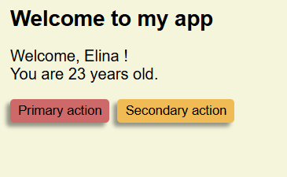

# Journal d'apprentissage - Elina Liault 

## Intro 

For this project, i have decided to learn react. I have so bases of front end dev and i want to learn more, especially in the library and framework sector, to be able to better discus and work with my dev counterparts. And i know i'm better at learning something when i have a project to use that skill for. Actually i usually learn skills because i need them to achieve a project i'm trying to do. So, this is a bit backward for me, but i am planning on using the react knowledge i will aquire to make my own portfolio. My goal long term would be to make my own portfolio myself from begging to end. That means i will probably need to complement my learning of react with so learn of the other steps of the process like hosting. And i feel like having this overview of the proccess will be usefull for me, since i feel like as a designer having a good view of the production process and the product is extremelly usful if not necessary to tailor the design to both the user and the stakeholders' demands and to the technical possibilities. Anyway, during this learning process, i will try to learn how to write a website in react, all the way to making it available on the world wide web.

## Where i'm starting from

## React test (October 2)

    function WelcomeText({ user }) {
    return (
        

        Welcome, {user.name} !   You are {user.age} years old.
        

    );
    }
    function Button({ type, text = "Bouton" }) {
    function handleClick() {
        alert("You clicked me!");
    }
    let buttonType;
    if (type == "primary") {
        buttonType = "primary";
    } else if (type == "secondary") {
        buttonType = "secondary";
    } else {
        buttonType = "";
    }
    return (
        <button className={buttonType} onClick={handleClick}>
        {text}
        </button>
    );
    }

    export default function MyApp() {
    return (
        

        <h1>Welcome to my app</h1>
        <WelcomeText user={{ name: "Elina", age: "23" }} />
        

            <Button type="primary" text="Primary action" />
            <Button type="secondary" text="Secondary action" />
        

        

    );
    }

## GitHub, github desktop, git (October 26)

## Chart.js (October, 27-29)

## Color functions (October 28/29, 2025)

## Side quest (October - December)